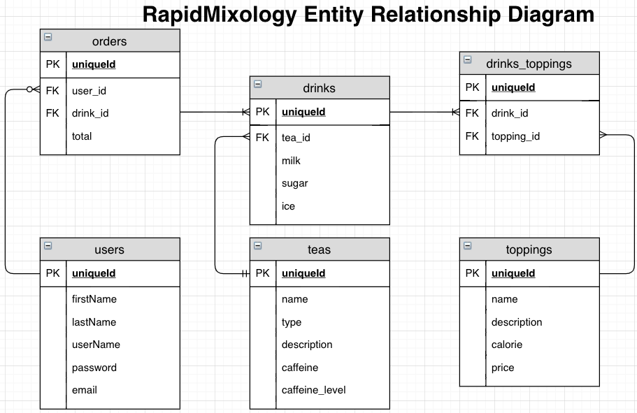
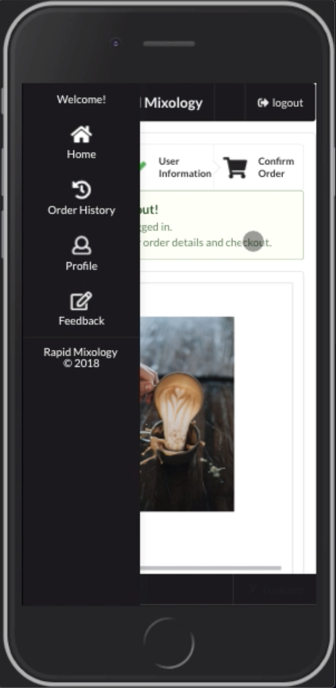
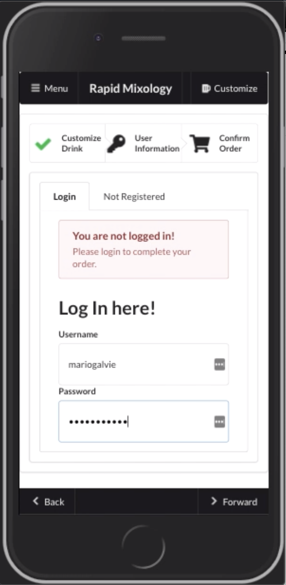
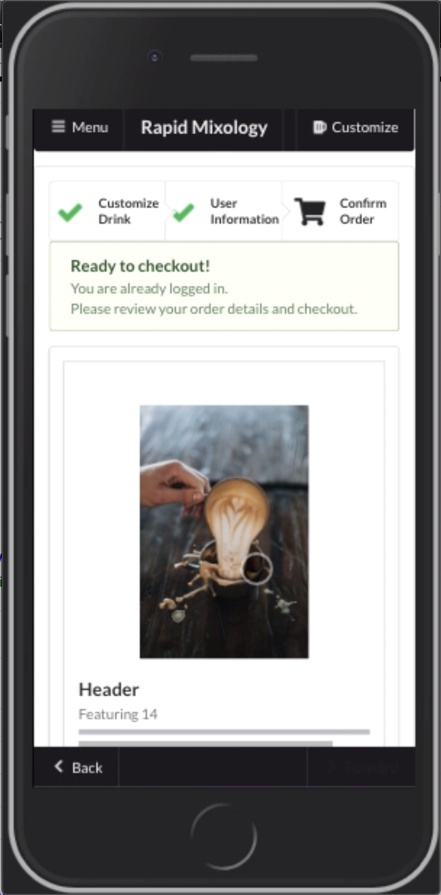
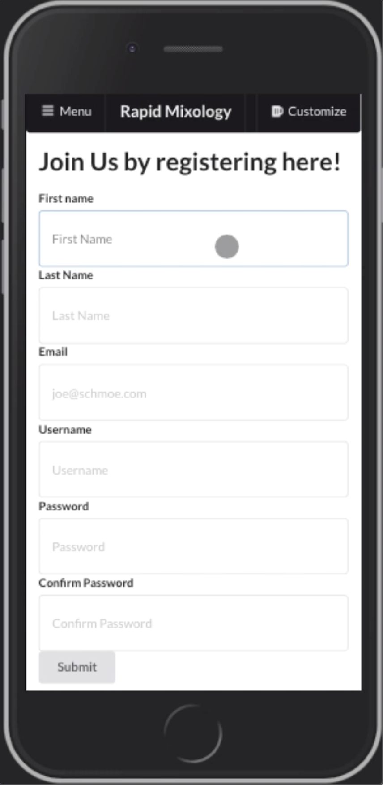
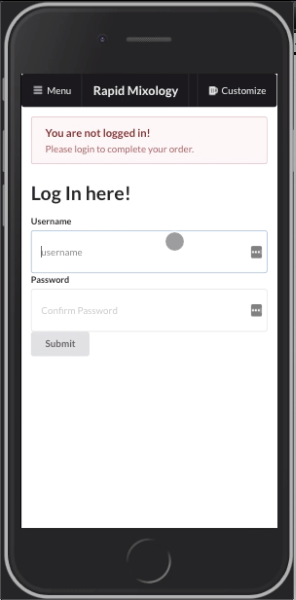

# RapidMixology (Explore and Experience curated artisan handpicked teas!)
Visit: https://rapidmixology.herokuapp.com
[Github], [Heroku-React], [Heroku-API], [Trello]
# Frontend: https://github.com/seintun/rapidmixology-frontend
# Backend: https://github.com/seintun/rapidmixology-backend
# Google Slide: https://docs.google.com/presentation/d/1C7ZV1ZZq_BXLG1jsVC0Bv5j6x6zvfh7Cdt_CHInHX00
# YouTube Demo: https://youtu.be/oiy1mZxWPdo

RapidMixology is a deployed mobile-focused customize your artisan teas service for 
- Tea enthusiatics / casual boba lover
- explore handpicked tea options beforehand
- customizable drinks through massive library of teas and toppings
- save their favorite or pick recommended drinks on their next visit

- Cafè owner
- looking to reach and market their presence
- facilitates and personalizes customer experience
- decreas wait-time and overheads for ordering process

# New Features!

- Added Carousel viewing on the restaurant listings to accomodate mobile's limited space
- Added Settings for diners to edit their Name, user ID, password and email
- Added abilities for diners to view their past order history
- Added fetch orders for restaurant in admin access

### ER Diagram Schema:










### Preview:


### Tech

RapidMixology uses a number of languages, tools and libraries to work properly:

* HTML - Hypertext Markup Language
* Semantic-UI - Another great stylesheet for React
* JavaScript - React, React-DOM, React-Router
* Redux
* [Semanti-UI-React] - great UI boilerplate for modern web apps
* [node.js] - evented I/O for the backend
* [Express] - fast node.js network app framework
* [Knex] - SQL query builder for Postgres
* [Postgresql] - object-relational database management system
* [Github] - free and open source distributed version control system
* [Trello] - Project Planning
* [Heroku-React] - Frontend deployed
* [Heroku-API] - Backend deployed
* [Imgur] - Image upload

### Installation

Eater24 requires [Node.js](https://nodejs.org/) to run.

Install the dependencies and devDependencies and start the server.

```sh
$ cd rapidmixology-frontend
$ npm install
$ npm start
```

[node.js]: <http://nodejs.org>
[Semanti-UI-React]: <http://twitter.github.com/bootstrap/>
[Express]: <http://expressjs.com>
[Knex]: <https://knexjs.org/>
[Postgresql]: <https://www.postgresql.org/>
[Github]: <https://github.com/seintun>
[Trello]: <https://trello.com/b/U4vdFnj4/q2-project>
[Surge]: <http://eater24-proj02.surge.sh/>
[Heroku-React]: <http://rapidmixology.herokuapp.com>
[Heroku-API]: <https://rapidmixology-api.herokuapp.com/teas>
